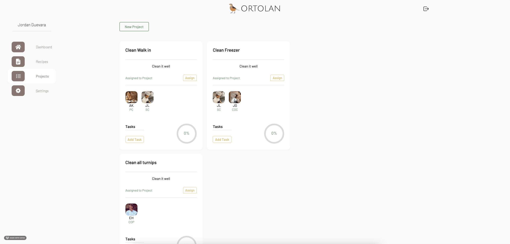

 

  

  <h3 align="center">Ortolan</h3>

  

    <a href="https://ortolan.herokuapp.com/" target="_blank"><strong>Explore the website »</strong></a>
     
     
  

<!-- TABLE OF CONTENTS -->

  
Table of Contents

  <ol>
    <li>
      <a href="#about-the-project">About The Project</a>
      <ul>
        <li><a href="#built-with">Built With</a></li>
      </ul>
    </li>
    <!-- <li><a href="#usage">Usage</a></li> -->
    <li>
      <a href="#interesting-issues">Interesting Issues</a>
    </li>
    <li>
      <a href="#features-to-implement-next">Features to Implement Next</a>
    <li><a href="#contact">Contact</a></li>
    </li>
  </ol>

<!-- ABOUT THE PROJECT -->
## About The Project 
[Back to top](#table-of-contents)

 

### [Ortolan](https://finstagram-project.herokuapp.com/)

Ortolan is a web application built for professional chefs to automate and organize the non technical aspect of cooking. Ortolan eases the creation, exploration, and organization of the recipe archival process. With every new recipe entered by a user Ortolan will be able to predict the completion of ingredients and ordering categories to help expedite the completion of recipe additions. Ortolan also offers a project board where projects can be made, tasks created, and assignments to cooks given. Watch the progress of these tasks in real time.

### Built With 
[Back to top](#table-of-contents)
* [AWS - Amazon Web Services](https://aws.amazon.com/)
* [PostgreSQL](https://www.postgresql.org/docs/)
* [SQLAlchemy](https://www.sqlalchemy.org/)
* [Flask](https://flask.palletsprojects.com/en/2.0.x/)
* [React](https://reactjs.org/)
* [Redux](https://redux.js.org/)

## Usage
Ortolan offers multiple search functionalities to find the recipe you are looking for. You can search via the tree, either by the tags of the recipe or the year/season. You can also use the search bar to find a specific recipe. Lastly, you can search by photo.

 

 

Ortolan offers a dynamic recipe creation form. Enter as many sub recipes and ingredients as needed. Everything can be adjusted. The title, the photo, the components, the season, the ingredients, the sub recipes, and the tags. Go wild! The more recipes a user enters, the more Ortolan will be able to help fill it out quicker. The database grows and knows what purveyors you are ordering things from and fills it out for you.

 

 

Ortolan offers the ability to go back into the recipes that you have previously published and change anything you need to.

 

 

Ortolan allows for organization of daily/weekly/monthly projects. Add the project, assign the cooks, watch the progress!

 

 

Create a new project by adding a title and description, and any optional smaller tasks for that project.

 

 

Upon completion, or if you decided to head another direction, delete any project!

 

 

## Interesting Issues:
### Dynamic Form for Recipe 
[Back to top](#table-of-contents) 

<b>Issue</b>: Each dish or base recipe can have many sub recipes. Each of these sub recipes can have many ingredients. I had a hard time wrapping my head around this at first while maintaining a clean state and controlling each input within the component. The backend I built required for each of these things be connected to each other. An ingredient to an ordering category and a sub recipe, and a sub recipe to the base recipe. Because of this I built the api endpoint for creating a recipe to recieve a giant JSON object, which breaks it down and creates those rows in the database in order.

<b>Solution</b>: I found a way to set the sub recipe state to an array filled with an object template for all of the keys that one sub recipe with one ingredient would have. When a user clicks to add an additional subrecipe, I copy the current state into an array, and push another one of the templates into it. For an ingredient in a specific sub recipe, I push another ingredient template into the specific subrecipe in the state. This way I'm able to keep track of each individual ingredient and sub recipe all in one state.

## Features to Implement Next
[Back to top](#table-of-contents)

<b>Overview</b>: I would like to implement many features to this application, I see this being something I work on for many years as a passion project. The next few features I would like to work on for the admin user include: Organizing the restaurants current menu, the ability to share certain recipes with team members, and an ordering guide for the entire current menu.

### <b>Feature</b>: Current Menu
<b>How I would do it</b>: This is a simple implementation, but I would add another table to the database that would like the admin user and a dish, any row of that table linked to a specific user would be a dish on the menu. Further I would like to add some additional information to that table, holding data on the current menu price, and position on the menu.

### <b>Feature</b>: Sharing Recipes
<b>How I would do it</b>: I believe this needs another table as well. Each row in this table would connect a recipe to a non admin user, and a non admin user would have a component made to see recipes that have been shared with them.

### <b>Feature</b>: Ordering Guide
<b>How I would do it</b>: I was thinking ahead a bit when I was designing the initial database schema for this project. Because of that, this feature will be seamless to add to the project. To make this work, I would grab all of the information about the current menu's subrecipes, which include the ingredients. Each ingredient has a category for ordering already set to it. I would then map through the data and organize the ingredients based on the category, and display it as so in a component.

<!-- CONTACT -->
## Contact
[Back to top](#table-of-contents)

Jordan Guevara - [LinkedIn](https://www.linkedin.com/in/jordan-guevara-a9370521a/) - jordansacct@gmail.com

Project Repo Link: [https://github.com/Jguevara1208/Ortolan](https://github.com/Jguevara1208/Ortolan)

Project Link: [https://ortolan.herokuapp.com/](https://ortolan.herokuapp.com/)

<!-- ACKNOWLEDGEMENTS --

<!-- MARKDOWN LINKS & IMAGES -->
[linkedin-url]: https://linkedin.com/in/
